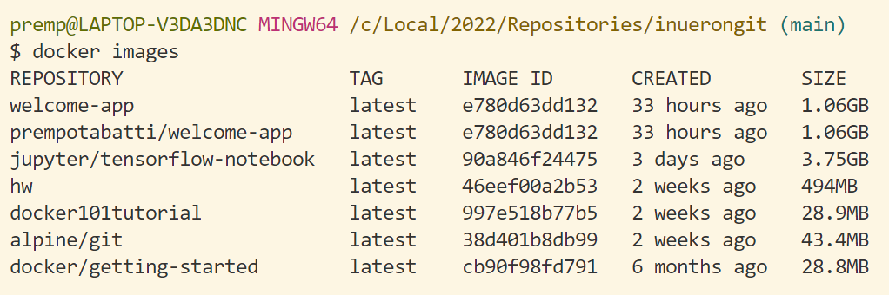
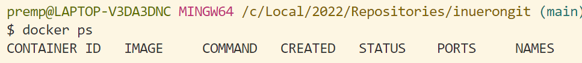
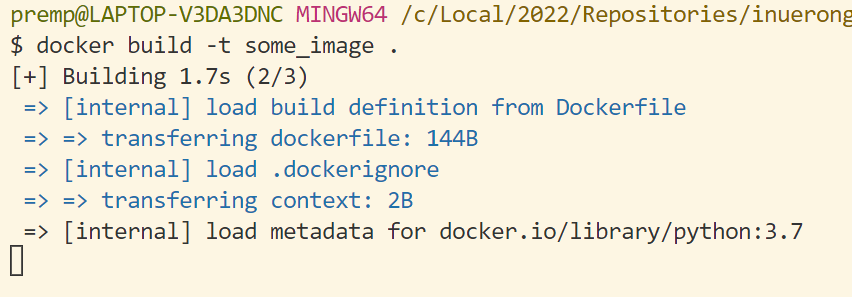
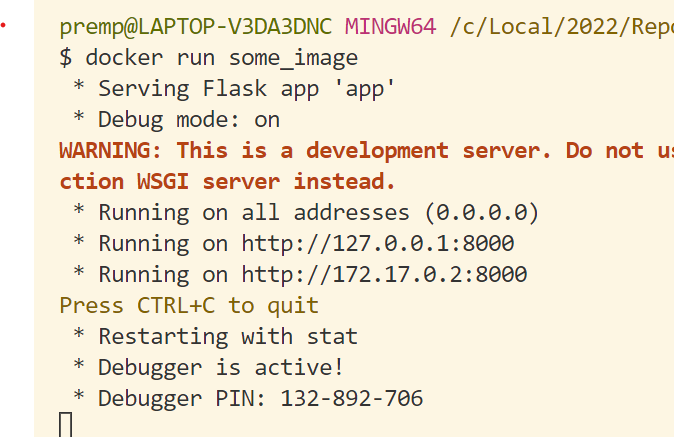
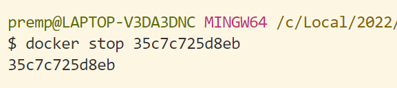
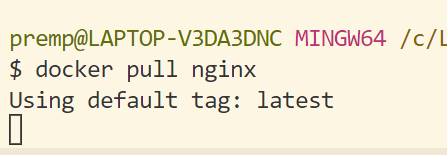
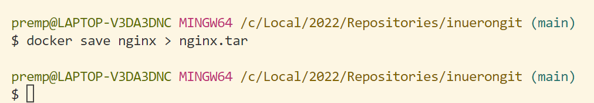
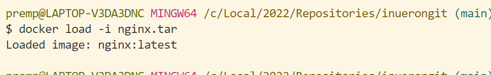
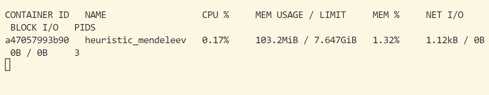

## Docker 15 commands
1. docker images

2. docker ps

3. docker build -t some_image .

4. docker run some_image

5. docker stop 35c7c725d8eb

6. docker rm some_container
7. docker container prune
8. docker start some_image
9. docker rename some_image some_container
10. docker rmi some_image
11. docker pull nginx

12. docker save nginx > nginx.tar

13. docker push some_image
14. docker load -i nginx.tar

15. docker stats

